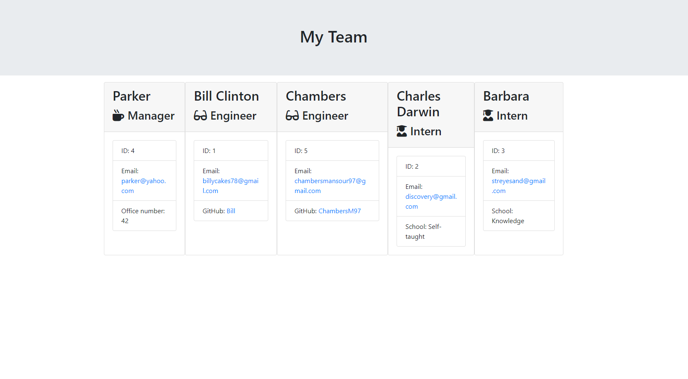

<h1 align="center">Welcome to Team Template Engine 👋</h1>
<p>
  
  <a href="https://github.com/stevetrilogy/unit10hw/graphs/commit-activity" target="_blank">
    
  </a>
  <a href="https://github.com/stevetrilogy/unit10hw/blob/master/LICENSE" target="_blank">
    
  </a>
</p>

> OOP and testing for week 10 homework

## Install

```sh
npm install
```

## Run tests

```sh
npm run test
```

## Author

👤 **Chambers Mansour**

* Github: [@ChambersM97](https://github.com/ChambersM97)
* LinkedIn: [@www.linkedin.com\/in\/chambers-mansour](https://linkedin.com/in/www.linkedin.com\/in\/chambers-mansour)





## Show your support

Give a ⭐️ if this project helped you!

## 📝 License

Copyright © 2020 [Chambers Mansour](https://github.com/ChambersM97).<br />


***
_This README was generated with ❤️ by [readme-md-generator](https://github.com/kefranabg/readme-md-generator)_